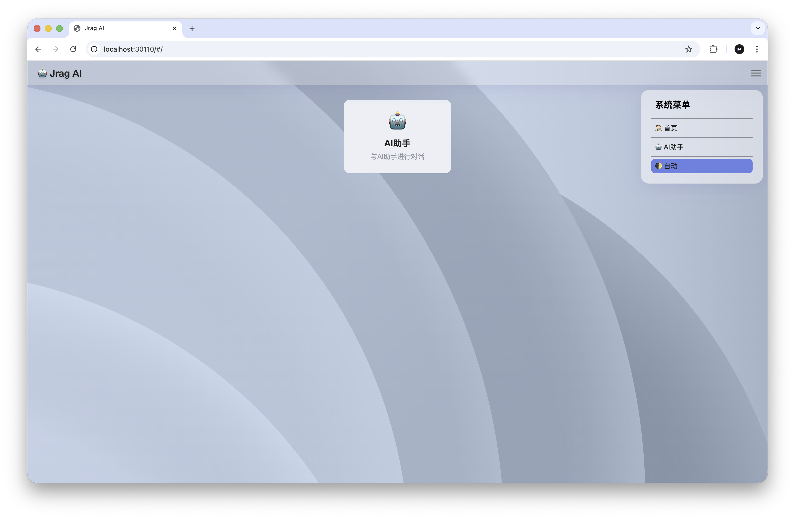
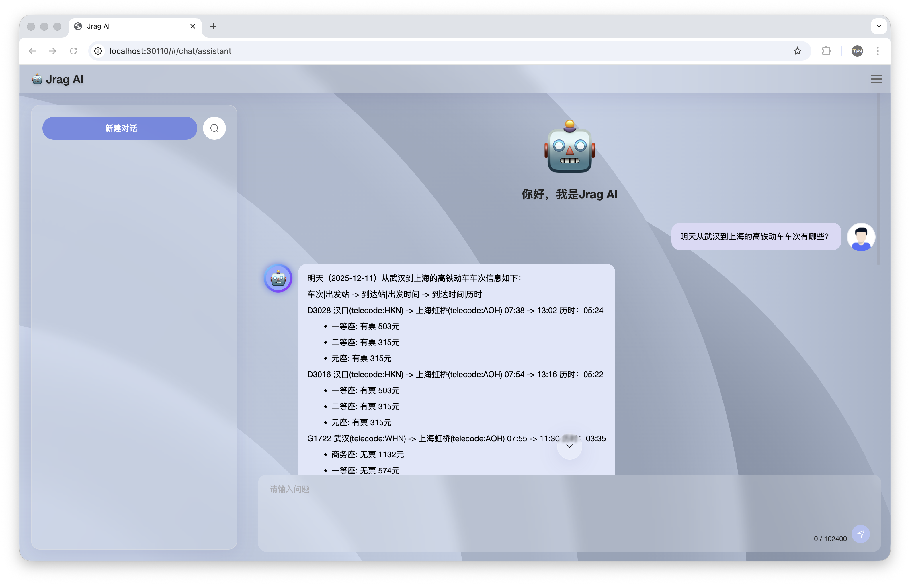
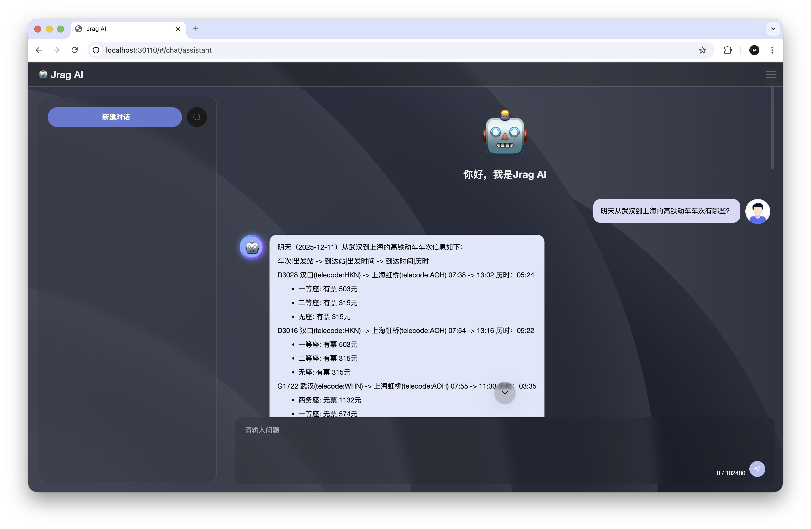
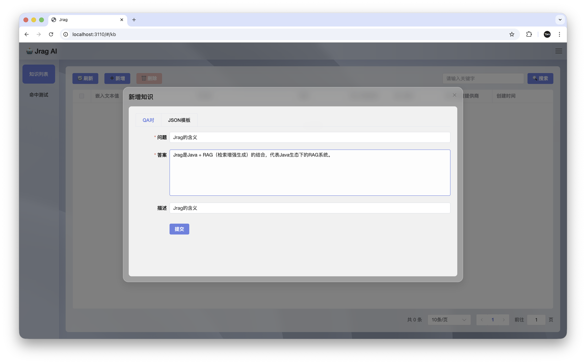
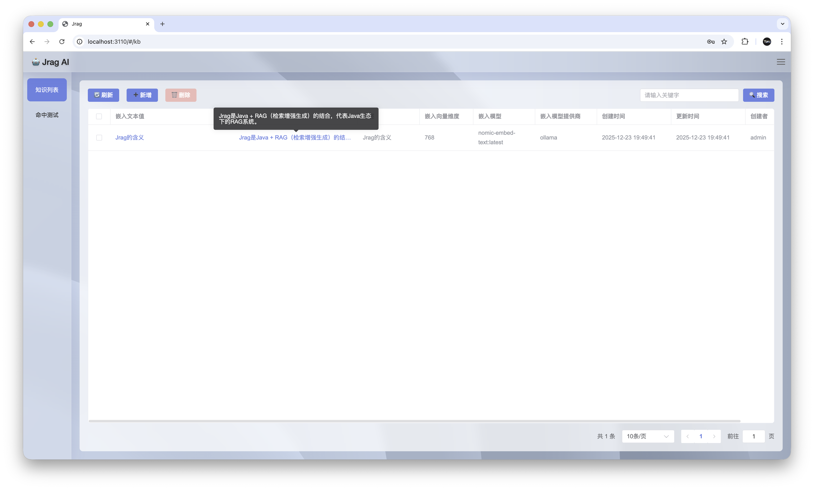
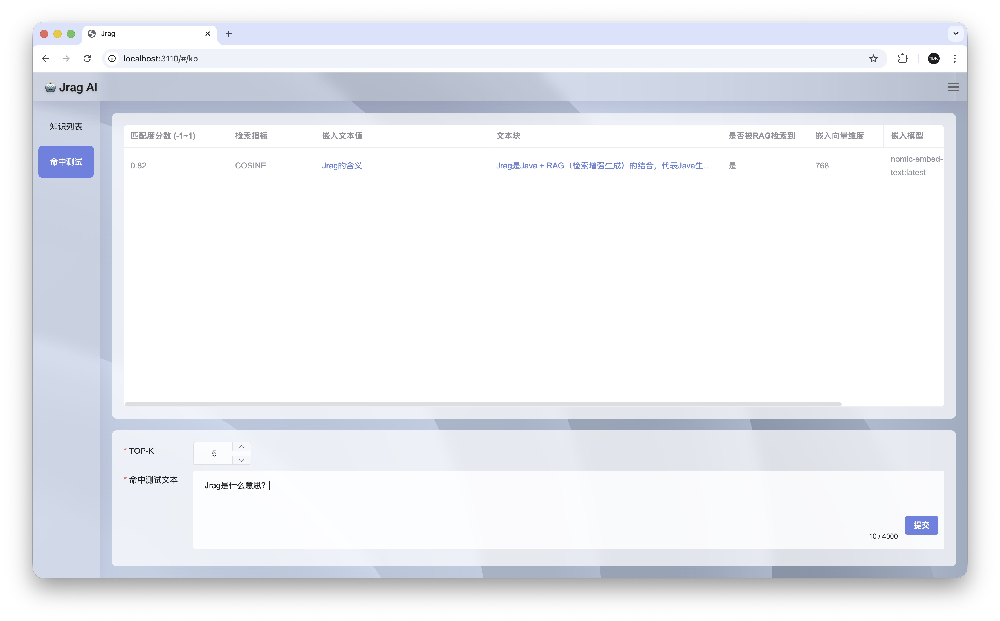
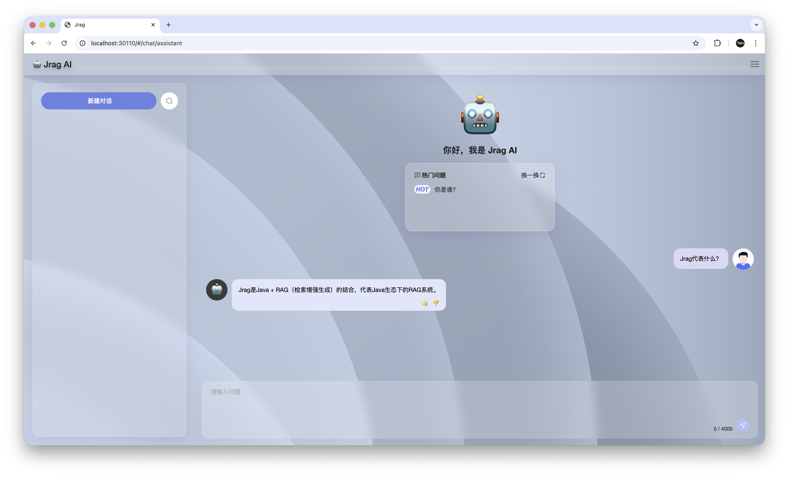

简体中文 | [English](README_en.md)

[](https://github.com/jerryt92/jrag)

Jrag 是一个基于 Java Spring Boot 的 RAG（Retrieval-Augmented Generation）和MCP工具接入平台，旨在通过结合检索、MCP工具与生成式AI模型技术，增强大语言模型在 Java 生态中的应用能力。该平台支持接入多种主流的大语言模型接口，包括 Ollama 和 OpenAI，并对接了 Milvus 与 向量数据库，以提供高效的向量存储与检索服务。

## 贡献者

<a href="https://github.com/jerryt92/jrag/graphs/contributors">
  
</a>

## Docker 一键部署

Docker 配置都在 `docker/` 目录下，默认会启动 Milvus（v2.6.9）与 Jrag。

```shell
docker compose -f docker/docker-compose.yml up -d --build
```

可配置项（`docker/.env`）：

- `JRAG_BASE_DIR`：宿主机配置/数据根目录（默认 `~/jrag`）
- `COMPOSE_PROJECT_NAME`：容器前缀（默认 `jrag`）
- `UPDATE_UI`：是否从 `jrag-ui` 拉最新 `dist`（`true`/`false`）
- `JRAG_UI_REPO`：UI 仓库地址（默认 `https://github.com/jerryt92/jrag-ui.git`）
- `JRAG_UI_BRANCH`：UI 分支（默认 `dist`）

访问：

- UI：`http://localhost:30110/`
- 健康检查：`http://localhost:30110/v1/api/jrag/health-check`

容器内访问宿主机地址：

- macOS/Windows：`host.docker.internal`
- Linux：`host.docker.internal`（需要 Docker 20.10+ 并配置 `extra_hosts: ["host.docker.internal:host-gateway"]`）

## 演示

[数据通信百科助手](https://jerryt92.github.io/data-communication-encyclopedia)

**数据通信百科助手**，基于Jrag，可以回答各种数据通信相关的问题。

## 架构


## 演示


## 用途

目前为止开源的 RAG 平台中，基本都是Python实现的，作为Javer，希望 Jrag 能够更适合 Java 开发者的使用，提供更适合 Java 开发者的LLM集成与应用。

## 特性

- **多模型支持**：兼容 Ollama 和 OpenAI 风格接口，灵活切换不同的大语言模型。
- **向量数据库集成**：支持 Milvus 向量数据库，满足不同场景下的性能需求。
- **Function Calling**：支持函数调用，让LLM能够调用其他系统的API。
- **MCP支持**：支持 MCP（模型上下文协议），以实现模型工具调用的标准化。
- MCP Client与LLM交互使用Function Calling技术，而不是Prompt，节约Tokens消耗。
- **Java生态优化**：专为 Java 开发者设计，简化 RAG 技术在 Java 项目中的集成与应用。
- **JDK21** ：Jrag 基于JDK21开发，可使用虚拟线程，提升并发性能。
- **知识维护**：提供知识库管理功能，支持知识库知识的增加、修改、删除和命中测试等操作。

## 界面

界面风格灵动，采用毛玻璃风格，支持暗色模式。







## 知识维护









## 待完善

- **Rerank**：提供 Rerank 功能，以实现对检索结果的排序和过滤。
- 适配MCP协议的Streamable HTTP传输层（等待Spring AI发布Release）。
- **知识库维护**：提供知识库管理功能，支持知识库的创建、导入、导出、删除等操作。

## 默认账号密码

admin  
jrag@2025

## 前端

```shell
rm -rf jrag-starter/src/main/resources/dist
git clone -b dist https://github.com/jerryt92/jrag-ui.git jrag-starter/src/main/resources/dist
```

[jrag-ui](https://github.com/jerryt92/jrag-ui)
