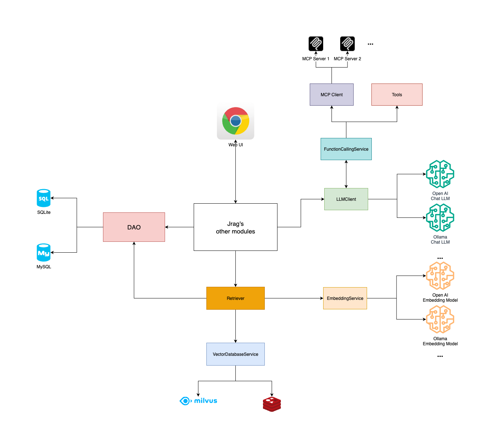

<div>
  简体中文 | <a title="English" href="./README_en.md">English</a>
</div>
<br/>

[](https://github.com/jerryt92/jrag)

Jrag 是一个基于 Java Spring Boot 的 RAG（Retrieval-Augmented Generation）和MCP工具接入平台，旨在通过结合检索、MCP工具与生成式AI模型技术，增强大语言模型在 Java 生态中的应用能力。该平台支持接入多种主流的大语言模型接口，包括 Ollama 和 OpenAI，并集成了 Milvus 与 Redis 两种向量数据库，以提供高效的向量存储与检索服务。

## 贡献者

<a href="https://github.com/jerryt92/jrag/graphs/contributors">
  
</a>

## 架构



## 用途

目前为止开源的 RAG 平台中，基本都是Python实现的，作为Javer，希望 Jrag 能够更适合 Java 开发者的使用，提供更适合 Java 开发者的LLM集成与应用。

## 特性

- **多模型支持**：兼容 Ollama 和 OpenAI 风格接口，灵活切换不同的大语言模型。
- **向量数据库集成**：支持 Milvus 和 Redis 向量数据库，满足不同场景下的性能需求。
- **Function Calling**：支持函数调用，让LLM能够调用其他系统的API。
- **MCP支持**：支持 MCP（模型上下文协议），以实现模型工具调用的标准化。
- MCP Client与LLM交互使用Function Calling技术，而不是Prompt，节约Tokens消耗。
- **Java生态优化**：专为 Java 开发者设计，简化 RAG 技术在 Java 项目中的集成与应用。
- **JDK21** ：Jrag 基于JDK21开发，可使用虚拟线程，提升并发性能。

## 待完善

- **Rerank**：提供 Rerank 功能，以实现对检索结果的排序和过滤。
- 适配MCP协议的Streamable HTTP传输层（等待Spring AI发布Release）。
- **知识库维护**：提供知识库管理功能，支持知识库的创建、导入、导出、删除等操作。

## SQLite 初始化

在jrag目录下执行：

```shell
mkdir -p ~/jrag
cp ./sqlite/jrag.db ~/jrag/jrag.db
```

## 默认账号密码

admin  
jrag@2025

## 前端

```shell
rm -rf jrag-starter/src/main/resources/dist
git clone -b dist https://github.com/jerryt92/jrag-ui.git jrag-starter/src/main/resources/dist
```

[jrag-ui](https://github.com/jerryt92/jrag-ui)