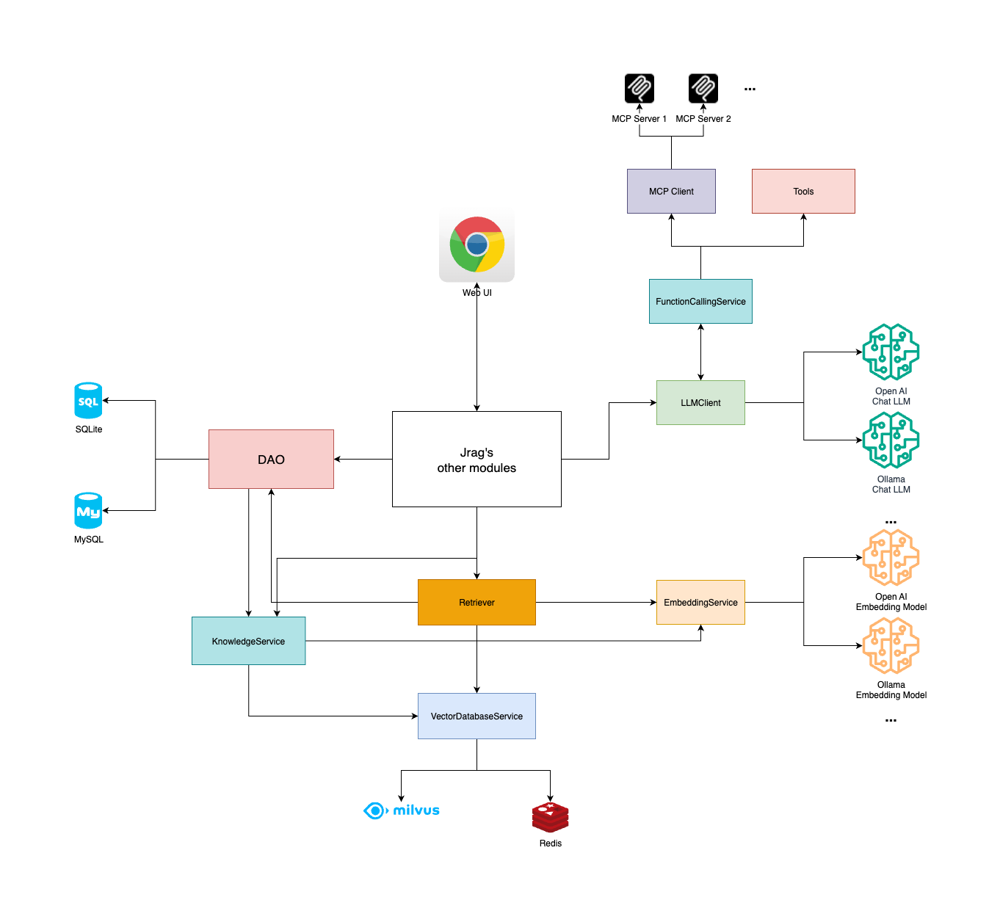

# Jrag

[](https://github.com/jerryt92/jrag)

[简体中文](README.md)

Jrag is a RAG (Retrieval-Augmented Generation) and MCP tool integration platform based on Java Spring Boot, designed to enhance the application capabilities of large language models within the Java ecosystem by combining retrieval, MCP tools, and generative AI model technologies. The platform supports integration with various mainstream large language model interfaces, including Ollama and OpenAI, and incorporates Milvus and Redis as vector databases to provide efficient vector storage and retrieval services.

## Architecture



## Purpose

So far, most open-source RAG platforms are implemented in Python. As a Java developer, I hope Jrag can be more suitable for Java developers' use, providing better LLM integration and application for Java developers.

## Features

- **Multi-model Support**: Compatible with Ollama and OpenAI-style interfaces, allowing flexible switching between different large language models.
- **Vector Database Integration**: Supports Milvus and Redis vector databases to meet performance requirements in different scenarios.
- **Function Calling**: Supports function calling, enabling LLMs to call APIs from other systems.
- **MCP Support**: Support MCP (Model Context Protocol) to standardize model tool calling.
- MCP Client interacts with LLM using Function Calling technology instead of Prompt, saving token consumption.
- **Java Ecosystem Optimization**: Designed specifically for Java developers to simplify the integration and application of RAG technology in Java projects.
- **JDK21**: Jrag is developed based on JDK21 and can use virtual threads to improve concurrent performance.

## To Be Improved

- **Knowledge Base Management**: Provide knowledge base management functions, supporting operations such as creation, import, export, and deletion of knowledge bases.

## SQLite Initialization

Execute the following commands in the jrag directory:

```shell
mkdir -p ~/jrag
cp ./sqlite/jrag.db ~/jrag/jrag.db
```

## Default Credentials

Username: admin  
Password: jrag@2025

## Frontend

```shell
rm -rf jrag-starter/src/main/resources/dist
git clone -b dist https://github.com/jerryt92/jrag-ui.git jrag-starter/src/main/resources/dist
```

[jrag-ui](https://github.com/jerryt92/jrag-ui)